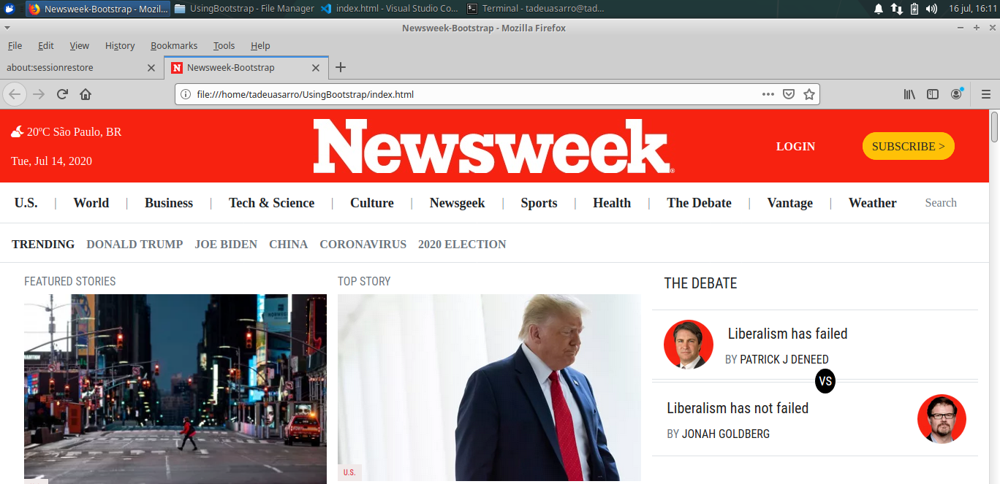

# Using Bootstrap

This project is focused on creating a responsive website, using Bootstrap. In this project we're required to create homepage of [Newsweek](https://newsweek.com)

In this task we were required to create a clone of the Newsweek website using the best practices of HTML, CSS & Bootstrap with GitHub process flow.

## Built With

- HTML,
- CSS3,
- Bootstrap.

## Live Demo

[Live Demo Link](https://rawcdn.githack.com/tadeuasarro/UsingBootstrap/6ad8f31651e03798300d1b5b9b63bc8f6846e840/index.html)

## Authors

👤 Tadeu Sarro

- Github: [@tadeuasarro](https://github.com/tadeuasarro)
- Twitter: [@tadeuasarro](https://twitter.com/tadeuasarro)
- Linkedin: [@tadeuasarro](https://www.linkedin.com/in/tadeu-sarro-71481013a/)

👤 Adesoji Adewumi

- Github: [@AdesojiCodeMaster](https://github.com/AdesojiCodeMaster)
- Twitter: [@codemas22665735](https://twitter.com/codemas22665735)
- Linkedin: [linkedin](https://www.linkedin.com/in/adesoji-adewumi-7752aba5)

## 🤝 Contributing

Contributions, issues and feature requests are welcome!

Feel free to check the [issues page](https://github.com/tadeuasarro/UsingBootstrap/issues)

## Show your support

Give a ⭐️ if you like this project!

## Acknowledgments

- Microverse
- GitHub
- TheOdinProject

## 📝 License

This project is open licensed.
